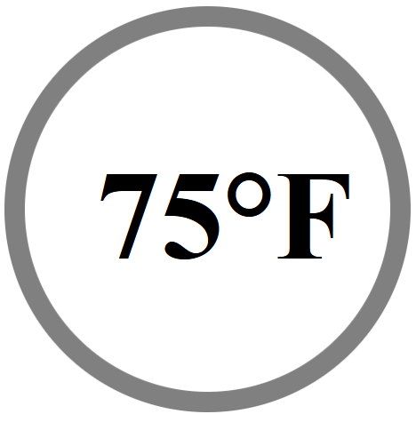

<p align="center">
    
</p>

**ESP8266ServerFoundation I2C.  Browser & Smart Phone access for I2C devices.**

- **Free**: open source software.  BE THE SAME.
- **Dynamic**: Change the default interface, configure the WiFi using SPIFFS filesystem.
  - **Work with (any) I2C device without reprogramming.**
- **Webserver**: REST API.  Access Point Captive Portal.  Serve custom .cs, .js, .html.
- **Websocket Server**: data feed provider.
- **Rudimentary**: A basic building block for something more.
  - no real error checking
  - validate your own .css, .html, .js, .cfg JSON notation enhancements

-----

## Requirements

- **Arduino IDE**: https://www.arduino.cc/en/software
- **ESP8266 Development Board**: <link to store>
- **I2C device**: <link to store>
- **Prototype Board**: <link to store>
- **Prototype Breadboard Wiring**: <link to store>


## Assembly

**Connect Pins**:

| **I2C Device** | **ESP8266** |
| -------------- | ----------- |
| VCC            | 3.3V        |
| GND            | GND         |
| SCL            | SCL         |
| SDA            | SDA         |


## Uploading code to the ESP8266 Development Board

1.  Open the **Adruino IDE**
2.  Open the ESP8266ServerFoundation sketch.
3.  Select the appropriate board and com port from the Tools menu of the Arduino IDE.
4.  Select Sketch -> Upload in the Arduino IDE.


## Initial accessing the ESP8266ServerFoundation device

- **Serial Monitor**: Access from Arduino IDE.
  - Accepts 1 Serial input command: `restart`
- **WiFi Access Point**: Default ssid = `ESP[device_mac_address]`
  - **Captive Portal**.  Open a web browser and go to any web address.  All redirect to device interface.


## Web API & example applications

Essentially open the web interface and review the source code of each page for examples.

- **Delete SPIFFS File**: `/api/deletespiffsfile?file==[filename]`
- **Edit SPIFFS File**: `/applications/editspiffsfile`
- **Format SPIFFS**:  `/api/formatspiffs'`
- **Get Data**:  `/api/getdata`
- **List SPIFFS**:  `/api/listspiffs`
- **Read EEPROM**:  `/api/readeeprom`
- **Read SPIFFS File**:  `/api/readspiffsfile?file=[filename]`
- **Restart Device**:  `/api/restartesp`
- **Scan Networks**:  `/api/scannetworks`
- **Websocket**:  `/applications/websocket`

## Configuring WiFi Station and Access Point

- **Edit SPIFFS File**: `/applications/editspiffsfile`
  - **filename**: `/wifi.cfg`
  ```
  {
   "enableStation":true,
   "WiFiConnection":
    [
     {
      "ssid":"ConnectToNetwork",
      "password":"Password",
      "connect":true,
      "hostname":""
     }
    ],
	 "enableAP":true,
     "softAP":
	  {
	   "ssid":"",
	   "psk":"",
	   "channel":1,
	   "hidden":true,
	   "max_connection":4
	  }
  }
  ```

## Further developing a device

`example target device: MPU6050`

1. Create a I2C device configuration file.

- **Edit SPIFFS File**: `/applications/editspiffsfile`
  - **filename**: `/i2c/0x68.cfg`
  ```
  {
   "address" : "0x68",
   "enable" : true,
   "initialize" : 
    [
     {
      "register" : "0x6B",
      "value" : 0
     }
    ],
   "userdata" : 
    [
     {
      "accelerometer" :
       {
        "offsetX" : 0,
        "offsetY" : 0,
        "offsetZ" : 0
       },
      "gyroscope" :
       {
        "offsetX" : 0,
        "offsetY" : 0,
        "offsetZ" : 0
       },
      "thermostat" :
       {
        "offsetTemperature" : 0
       }
     }
    ],
   "getdata" : 
    [
     {
      "register" : "0x3B",
      "bytes" : 14
     }
    ]
  }
  ```

2. Restart device.
  
3. Create a custom interface (optional)

- **Edit SPIFFS File**: `/applications/editspiffsfile`
  - **filename**: `/applications/xylevel.css`
  ```
  div.axis_container {position: relative; width: 45vmin; height: 45vmin;}
  div.axis_container > div { position: absolute; }
  div.axis_label { font-weight: bold; }
  div.axis_dial {width: 100%; height: 100%; border: 3px dotted grey; border-radius: 50%;}
  div.axis_reticle
   {
    width: 100%;height: 100%;left: 3px;top: 3px;background-color: grey;
    clip-path: polygon(49% 0%, 51% 0%, 51% 49%, 100% 49%, 100% 51%, 51% 51%, 51% 100%, 49% 100%, 49% 51%, 0% 51%, 0% 49%, 49% 49%);
   }
  div[id=x_axis_indicator] {width: 100%;height: 100%;left: 3px;top: 3px;transform: rotate(00deg);transform-origin: center;}
  div.axis_level {position: absolute; width: 100%; height: 100%; background-color: red; clip-path: polygon(0% 49%, 100% 49%, 100% 51%, 0% 51%);}
  div.axis_label_left {position: absolute; top: 40%; text-align: left; font-weight: bold; font-size: 1em;}
  div.axis_label_right {position: absolute; right: 0%; top: 40%; text-align: left; font-weight: bold; font-size: 1em;}
  div.axis_degree {bottom: -6px; right: 35%; width: 30%; text-align: right; font-weight: bold; font-size: 3em; background-color: white;}
  div[id=y_axis_indicator] {width: 100%; height: 100%; left: 3px; top: 3px; transform: rotate(00deg); transform-origin: center;}
  ```

- **Edit SPIFFS File**: `/applications/editspiffsfile`
  - **filename**: `/applications/xylevel.html`
  ```
  <html lang='en'>
    <head>
      <title>MPU6050 Accelerometer I2C 0x68 Example</title>
      <meta http-equiv='Cache-Control' content='no-cache, no-store, must-revalidate' />
      <meta http-equiv='Pragma' content='no-cache' />
      <meta http-equiv='Expires' content='0' />
      <link rel="stylesheet" href="xylevel.css">
      <script src="xylevel.js"></script>
    </head>
    <body>
      <div class='axis_container'>
        <div class='axis_label'>X Axis</div>
        <div class='axis_dial'></div>
        <div class='axis_reticle'></div>
        <div id='x_axis_indicator'>
          <div class='axis_level'></div>
          <div class='axis_label_left'>Left</div>
          <div class='axis_label_right'>Right</div>
        </div>
        <div id='x_axis_degree' class='axis_degree'>00&deg;</div>
      </div>
      <div class='axis_container'>
        <div class='axis_label'>Y Axis</div>
        <div class='axis_dial'></div>
        <div class='axis_reticle'></div>
        <div id='y_axis_indicator'>
          <div class='axis_level'></div>
          <div class='axis_label_left'>Back</div>
          <div class='axis_label_right'>Front</div>
        </div>
        <div id='y_axis_degree' class='axis_degree'>00&deg;</div>
      </div>
      <div>Socket Status: <span id="socket_status"></spam></div>
      div>x_device: <span id="x_device"></spam></div>
      <div>x_var Data</div>
      <div id='x_var_data'></div>
      div>Raw Data</div>
      <div id='raw_data'></div>
    </body>
  </html>
  ```

- **Edit SPIFFS File**: `/applications/editspiffsfile`
  - **filename**: `/applications/xylevel.js`
  ```
  function WordToQWord(x_word)
  {
   x_word = x_word << 48;
   x_word = x_word >> 48;
   return x_word;
  }

  let x_deviceId = 0x68;
  let x_averageX = new Array(0,0,0,0,0,0,0,0,0,0,0,0,0,0,0,0,0,0,0,0);
  let x_averageY = new Array(0,0,0,0,0,0,0,0,0,0,0,0,0,0,0,0,0,0,0,0);

  socket = new WebSocket('ws:/' + '/' + location.host + ':81');
  socket.onopen = function(e) { document.getElementById('socket_status').innerHTML = location.host; };
  socket.onclose = function(e) { document.getElementById('socket_status').innerHTML = "closed"; };
  socket.onerror = function(e) { document.getElementById('socket_status').innerHTML = 'socket error'; };
  socket.onmessage = function(e)
   {
    let x_var = JSON.parse("{}");
    let x_data = JSON.parse(e.data);
    let x_device = x_data.i2cbus.device.filter(function (entry) { return entry.address == '0x68'; });
    x_var["x"] = WordToQWord((x_device[0].getdata[0].data[0] << 8 | x_device[0].getdata[0].data[1]));
    x_var["y"] = WordToQWord((x_device[0].getdata[0].data[2] << 8 | x_device[0].getdata[0].data[3]));
    x_var["z"] = WordToQWord((x_device[0].getdata[0].data[4] << 8 | x_device[0].getdata[0].data[5]));
    x_var["temp"] = WordToQWord((x_device[0].getdata[0].data[6] << 8 | x_device[0].getdata[0].data[7])) / 340 + 36.53;

    x_anglex = (Math.atan(x_var["x"]/Math.sqrt((x_var["y"]*x_var["y"]) + (x_var["z"]*x_var["z"])))) * (180/Math.PI);

    x_anglex = x_anglex + x_device[0].userdata.accelerometer.offsetX;
    x_angley = (Math.atan(x_var["y"]/Math.sqrt((x_var["x"]*x_var["x"]) + (x_var["z"]*x_var["z"])))) * (180/Math.PI);
    x_angley = x_angley + x_device[0].userdata.accelerometer.offsetY;
    x_averageX.shift();
    x_averageX.push(x_anglex);
    x_averageY.shift();
    x_averageY.push(x_angley);
    let loopx = 0;
    for (x_loop = 0; x_loop < x_averageX.length; x_loop++)
     { loopx += x_averageX[x_loop]; }
    x_anglex = loopx / x_averageX.length;
    let loopy = 0;
    for (x_loop = 0; x_loop < x_averageY.length; x_loop++)
     { loopy += x_averageY[x_loop]; }
    x_angley = loopy / x_averageY.length;
    x_f = (x_var["temp"] * 1.8) + 32;
    x_rotate = x_anglex.toFixed(1).toString() + 'deg';
    y_rotate = x_angley.toFixed(1).toString() + 'deg';
    document.getElementById('x_axis_degree').innerHTML = x_anglex.toFixed(1) + '&deg;'
    document.getElementById('y_axis_degree').innerHTML = x_angley.toFixed(1) + '&deg;'
    document.getElementById('x_axis_indicator').style.transform = 'rotate(' + x_rotate + ')';
    document.getElementById('y_axis_indicator').style.transform = 'rotate(' + y_rotate + ')';
    document.getElementById('raw_data').innerHTML = e.data;

    document.getElementById('raw_data').innerHTML = e.data;
    document.getElementById('x_var_data').innerHTML = JSON.stringify(x_var);
    document.getElementById('x_device').innerHTML = String(x_var["temp"].toFixed(2)) + "C : " + String(x_f.toFixed(2)) + "F";
   };
  ```
  
4. Navigate to `<hostname>/applications/xylevel.html`

<p align="center">
    
</p>

5. Create a custom interface (optional)

- **Edit SPIFFS File**: `/applications/editspiffsfile`
  - **filename**: `/applications/thermometer.css`
  ```
  div.container {position: relative; width: 86vmin; height: 86vmin;}
  div.container > div { position: absolute; }
  div.dial {width: 100%; height: 100%; border: 5vmin solid grey; border-radius: 50%;}
  div[id=temperature] {position: absolute; top: 32vmin; right: 4vmin; font-weight: bold; font-size: 30vmin;}
  ```

- **Edit SPIFFS File**: `/applications/editspiffsfile`
  - **filename**: `/applications/thermometer.html`
  ```
  <html lang='en'>
    <head>
      <title>MPU6050 Accelerometer I2C 0x68 Example</title>
      <meta http-equiv='Cache-Control' content='no-cache, no-store, must-revalidate' />
      <meta http-equiv='Pragma' content='no-cache' />
      <meta http-equiv='Expires' content='0' />
      <link rel="stylesheet" href="thermometer.css">
      <script src="thermometer.js"></script>
    </head>
    <body>
      <div class='container'>
        <div class='dial'></div>
        <div id='temperature'>00&deg;F</div>
      </div>
      <div>Raw Data</div>
      <div id='raw_data'></div>
    </body>
  </html>
  ```

- **Edit SPIFFS File**: `/applications/editspiffsfile`
  - **filename**: `/applications/thermometer.js`
  ```
  function WordToQWord(x_word)
  {
   x_word = x_word << 48;
   x_word = x_word >> 48;
   return x_word;
  }

  let x_averageTemp = new Array(0,0,0,0,0,0,0,0,0,0,0,0,0,0,0,0,0,0,0,0);

  socket = new WebSocket('ws:/' + '/' + location.host + ':81');
  socket.onopen = function(e) { document.getElementById('socket_status').innerHTML = location.host; };
  socket.onclose = function(e) { document.getElementById('socket_status').innerHTML = "closed"; };
  socket.onerror = function(e) { document.getElementById('socket_status').innerHTML = 'socket error'; };
  socket.onmessage = function(e)
   {
    let x_var = JSON.parse("{}");
    let x_data = JSON.parse(e.data);
    let x_device = x_data.i2cbus.device.filter(function (entry) { return entry.address == '0x68'; });
    x_var["temp"] = WordToQWord((x_device[0].getdata[0].data[6] << 8 | x_device[0].getdata[0].data[7])) / 340 + 36.53;

    x_averageTemp.shift();
    x_averageTemp.push(x_var["temp"]);
    let loopTemp = 0;
    for (x_loop = 0; x_loop < x_averageTemp.length; x_loop++)
     { loopTemp += x_averageTemp[x_loop]; }
    let x_temp = loopTemp / x_averageTemp.length;

    x_f = (x_temp * 1.8) + 32;
    document.getElementById('temperature').innerHTML = String(x_f.toFixed(0)) + "&degF";
    //document.getElementById('raw_data').innerHTML = e.data;
   };
  ```
  
4. Navigate to `<hostname>/applications/thermometer.html`

<p align="center">
    
</p>

