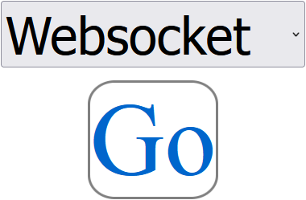

<p align="center">
    
</p>

**ESP8266ServerFoundation I2C.  Browser & Smart Phone access for I2C devices.**

- **Free**: open source software.  BE THE SAME.
- **Dynamic**: Change the default interface, configure the WiFi using SPIFFS filesystem.
  - **Work with (any) I2C device without reprogramming.**
- **Webserver**: REST API.  Access Point Captive Portal.  Serve custom .cs, .js, .html.
- **Websocket Server**: data feed provider.
- **Rudimentary**: A basic building block for something more.
  - no real error checking
  - validate your own .css, .html, .js, .cfg JSON notation enhancements

-----

## I2C Device Files

`example target device: MPU6050`


- **Edit SPIFFS File**: `/applications/editspiffsfile`
  - **filename**: `/i2c/0x68.cfg`
  ```
  {
   "address" : "0x68", <-- I2C address of device
   "enable" : true, <-- (true/false) enable device
   "initialize" :  <-- Initialization sequence, array of {"register", "value"} sets
    [
     {
      "register" : "0x6B", <-- Register to write to
      "value" : 0 <-- Value to write to register
     }
    ],
   "userdata" : <-- User data (this is user defined data that will get passed passed along with the call to getdata() in the main loop
    [
     {
      "accelerometer" :
       {
        "offsetX" : 0,
        "offsetY" : 0,
        "offsetZ" : 0
       },
      "gyroscope" :
       {
        "offsetX" : 0,
        "offsetY" : 0,
        "offsetZ" : 0
       },
      "thermostat" :
       {
        "offsetTemperature" : 0
       }
     }
    ],
   "getdata" : <-- Get data, array of {"register", "bytes"} sets.  position [0] will be returned in calls to getdata()
    [
     {
      "register" : "0x3B", <-- Starting register to read
      "bytes" : 14 <-- bytes to read
     }
    ]
  }
  ```

**Configuration changes require a device restart**
